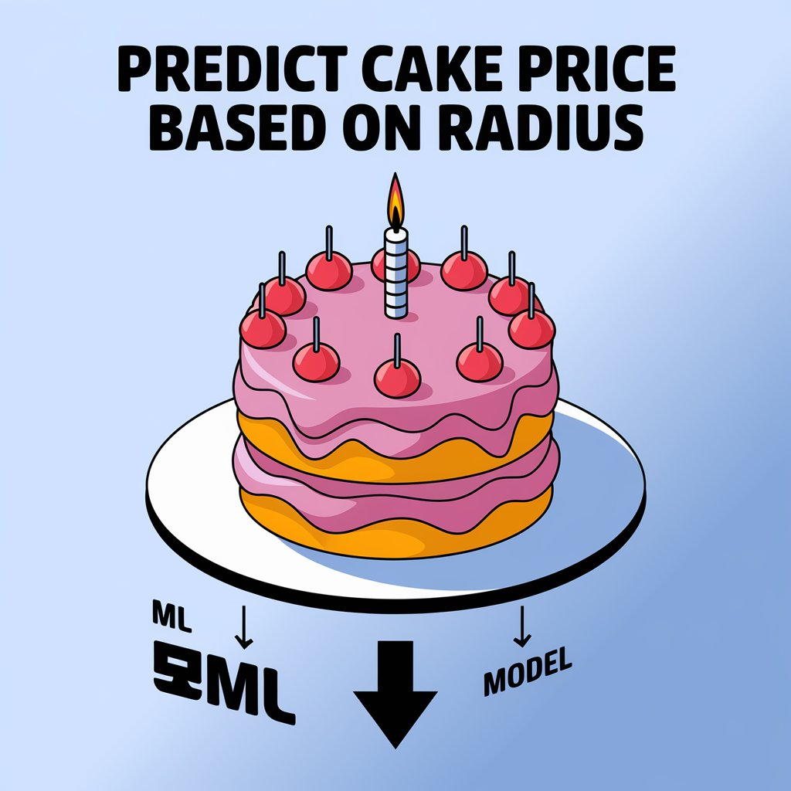

# Cake Price Prediction API
This Flask API provides price predictions for cakes based on their characteristics using a trained machine learning model.

## Overview
The API uses a Linear Regression model to predict cake prices based on the following features:
	•	Radius (cm)
	•	Number of Layers
	•	Topping Type

## Installation
install the reuired packages using the following command:
```bash
pip install -r requirements.txt
```

## Usage
1. start the Flask server:
```bash
python main.py
```

1.	Send POST requests to `/predict` endpoint with JSON payload:
```json
{
    "radius": 10,
    "layers": 2,
    "topping": 1
}
```
The API will return a JSON response with the predicted price:
```json
{
    "prediction": 311.0
}

```